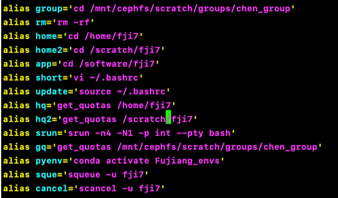
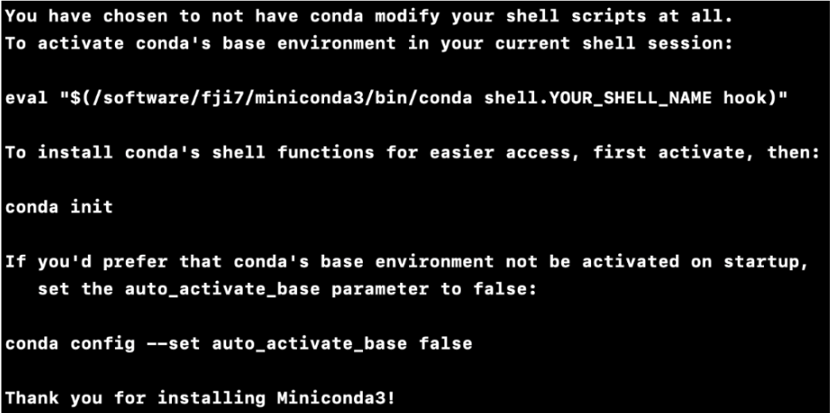
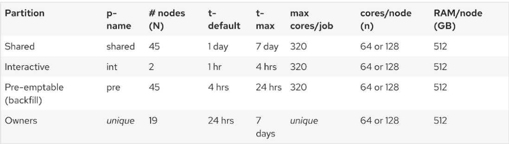

# Instructions on How to use HPC and CHTC at UW-Madison

## Command Lines
* **[HPC at UW-Madison](https://chtc.cs.wisc.edu/uw-research-computing/hpc-overview)**: It runs for a maximum of 7 days, equivalent to a large computer. 
* **[HTC at UW-Madison](https://chtc.cs.wisc.edu/)**: It runs for a maximum of 3 days and can run multiple jobs in parallel, then combine the results together. 
* How to determine if a task is suitable for running on HPC (a large computer where tasks can interact but also perform parallel computing) or HTC (multiple computers running together without task interaction).
* Terminal (Mac) & Ubuntu (Win) connect to HPC: `ssh NetID@hpclogin3.chtc.wisc.edu`
* Terminal (Mac) & Ubuntu (Win) connect to HTC: `ssh NetID@submit3.chtc.wisc.edu`
* Abtain the path of files: `readlink -f file.txt` (Linux);  `bash-3.2$ pwd file.txt` (bash) ([Link](https://juejin.cn/post/6844903481728303112)).
* Navigating directories: `cd` ([Link](https://linuxize.com/post/linux-cd-command/)).
* Display a list of files: `ls` ([Link](https://www.atatus.com/blog/ls-command-in-linux-with-example/))
* Display the contents of one or more files: `cat` (short for: concatenate) is used to concatenate files and display their contents on the standard output device ([Link](https://phoenixnap.com/kb/linux-cat-command))
* `echo “A B B A C C” > example.txt` is used to write the string "A B B A C C" to a new file called "example.txt".
* `python3 wc.py example.txt` is to run the Python script `wc.py` with the example.txt file as input data in the terminal.
* Transfer files:
  * Local desktop % `scp NetID@hpclogin3.chtc.wisc.edu:/home/sample.zip .`transfer data from HPC/HTC to local PC.
  * `scp test.zip NetID@hpclogin3.chtc.wisc.edu:/home/` transfer data from local PC to HPC. 
  * Local desktop % `scp -r NetID@hpclogin3.chtc.wisc.edu:/mnt/cephfs/scratch/temp /Volumes/data` transfer the whole directory data from HPC/HTC to local PC.
* Compressing files:
  * `zip -r example.zip example` Compressing files.
  * `unzip -l name.zip` is used to list the files and directories inside a ZIP archive without actually extracting them.
  * `unzip example.zip` To unzip the file "exaplem.zip" and extract its contents into the current folder.
  * `tar -cvf data_folder/data.tar data_folder/` compress data.
  * `tar -xzf data_folder/data.tar.gz -C data_folder/` uzip data.
  * `tar -xvf data_folder/data.tar -C data_folder/` unzip data.
* `g++ xtem423e4.cpp -o temmodel` Compile terrestrial ecosystem model, we have the g++ compiler installed and that the source code file xtem423e4.cpp is in the current directory. It compiles the source code and generates an executable named temmodel using the -o flag.
* `./temmodel tem4.para tem4.log` run TEM, temmodel executable file in the current directory, and you want to run it with the input parameters file tem4.para and output log file tem4.log.
* `wc -l filename` is used to count the number of lines in a file.
* HTC: `condor_q` is used to query and manage jobs in the HTCondor system. It provides information about the status of submitted jobs, such as their ID, current status (queued, running, completed, etc.), and resource usage; `condor_status` is used to monitor and view the status of computers (also referred to as resources or execution hosts) within the HTCondor system. It provides information about the availability, load, and other attributes of the computers registered with HTCondor.
* `grep mkclds *` is used to search for the pattern "mkclds" in all files in the current directory.
* `:q!` Quit vi without saving changes. `:wq!` Save changes and exit vi forcefully.
module avail is to view the available modules on your system
* `make` using gfortran compile, navigate to the directory containing the Makefile and the Fortran source files and run the make command. This will execute the build rule specified in the Makefile, compiling the program using gfortran and generating the executable.
* How to create alias on local PC and HPC.
  * HPC and HTC:
    * `vi ~/.bashrc` setting alias.
    * `source ~/.bashrc` update alias after setting it.

  * Login to HPC without password:
    * Step1: passwordless login: [Link](https://originalix.github.io/2018/04/26/%E5%9C%A8Mac%E4%B8%8A%E4%BD%BF%E7%94%A8ssh-key%E5%85%8D%E5%AF%86%E7%A0%81%E7%99%BB%E5%BD%95%E6%9C%8D%E5%8A%A1%E5%99%A8/).
    * Step2: `scp ~/.ssh/id_rsa.pub ssh NetID@hpclogin3.chtc.wisc.edu:/home/NetID/.ssh/`
    * Step3: `scp ~/.ssh/id_rsa.pub ssh NetID@submit3.chtc.wisc.edu:/home/NetID/.ssh/`
    * Step4: `nano ~/.zshrc` setting alias (Mac, local)
    * Step5: `source ~/.zshrc` update alias (Mac, local)
* Connect VS code and HPC: [Link](https://code.visualstudio.com/docs/remote/ssh-tutorial).

## Run Python Programs on HPC:
1. Install Miniconda on software directory (Link):
   * `wget https://repo.anaconda.com/miniconda/Miniconda3-latest-Linux-x86_64.sh`
   * `sh Miniconda3-latest-Linux-x86_64.sh` install Miniconda on the software directory.
   
   * After installation, active base environment: eval "$(/software/fji7/miniconda3/bin/conda shell.bash  hook)" ([Link](https://stackoverflow.com/questions/55507519/python-activate-conda-env-through-shell-script)).
2. View how many environments are already built: `conda env list`
3. Build or delete an environment for conda: `conda create -n envs_name python=x.x`,   `conda env remove --name envs_name`
4. Activate/ deactivate the environment: `conda activate envs_name`, `conda deactivate`
5. Install packages you need: `conda install packages`; `pip install packages`
6. Before submitting jobs, we can apply a small compute resource to debug on HPC: `srun -n4 -N1 -p int --pty bash` ([Link1](https://chtc.cs.wisc.edu/uw-research-computing/hpc-job-submission.html), [Link2](https://chtc.cs.wisc.edu/uw-research-computing/hpc-overview.html)).
7. Terminal run python file: `python name.py` or `runipy name.ipynb`
8. Submit jobs: ([Link1](https://chtc.cs.wisc.edu/uw-research-computing/hpc-job-submission.html), [Link2](Link)): `sbatch tasks_upload.sh` (below shows the template script of `tasks_upload.sh`)
```
#!/bin/bash
# Sets the name of the job. This is typically used for identification purposes.
#SBATCH --job-name=PLSR_modeling
# Requests one compute node for the job
#SBATCH --nodes=1
# 10 tasks (or processes) running per node. This parameter is relevant for parallel computing.
#SBATCH --ntasks-per-node=1
# Define the number of CPUs allocated per task
#SBATCH --cpus-per-task=1
# maximum memory for the whole job is 128GB
#SBATCH --mem=128gb
# specifies the maximum runtime for the job as 24 hours
#SBATCH --time=24:00:00
# the log file
#SBATCH --output=PLSR_modeling.out
# Activate the conda environment
source /software/fji7/miniconda3/bin/activate /software/fji7/miniconda3/envs/Fujiang_envs
# Run the script
python /home/fji7/HPC_test/Spatial_PFTs.py

```

* In a typical computing system, there is a hierarchical relationship between nodes, cores, and CPUs:
   * Node: A node refers to a physical computing unit or a server in a distributed computing system. It can consist of one or more CPUs.
   * Core: A core is an individual processing unit within a CPU. Modern CPUs often have multiple cores, which allows for parallel processing. Each core can execute instructions independently.
   * CPU: The Central Processing Unit (CPU) is the main processing unit of a computer. It consists of one or more cores. Each CPU can handle multiple tasks concurrently by utilizing its cores.
* It's important to note that while a CPU can have multiple cores, each core can execute its own thread or process independently. Therefore, a CPU with multiple cores can handle multiple programs or processes simultaneously. This is known as parallel processing, where different cores execute different instructions concurrently, improving overall performance and multitasking capabilities.
* A node contains one or more CPUs, each CPU can have multiple cores, and each core can handle a separate program or process concurrently. This hierarchical structure allows for efficient multitasking and parallel processing in modern computing systems (below shows the resources available at UW-Madison HPC).

